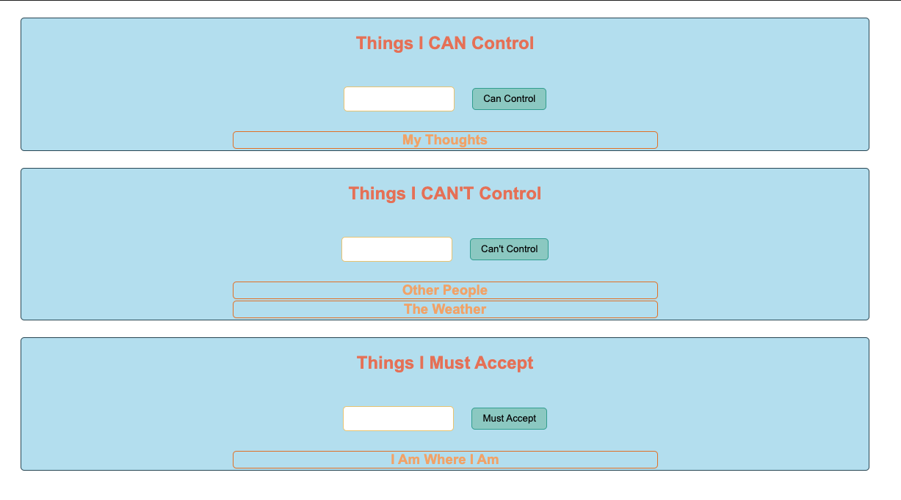

# 101-important-to-do-list

  > NOTE: This is a README file. It's the place for instructions about all code bases. Whenever you are given or find a new repo to use the first place you should start is at it README file.

## Overview

The Challenge you have before class will ask you to repeat what we did together in this lesson. You're going to create three lists to keep up with some very important topics:

* "Things I Can Control"
* "Things I Can't Control"
* "Things I Must Accept"

* **Step 1**: Fork and Clone this repo into your `DevFolder`
* **Step 2**: Open the code in VS Code, read the `index.html` file to see if you know what it's doing.
* **Step 3**: Start Live server and test the first input
* **Step 4**: Use the existing code to create three Section Elements titled with H2 elements:
  * "Things I Can Control"
  * "Things I Can't Control"
  * "Things I Must Accept"
* **Step 5**: Follow the logic of how the "Things I Can Control" input & button works to make the "Things I Can't Control" input & button work.
* **Step 6**: Test to perfection before moving on.
* **Step 7**: Repeat the process for the third section: "Things I Must Accept"
* **Step 8**: Bring this into class with you.
* **Step 9**: `git status`, `git add -A`, `git status`, `git commit -m "finished"`, `git push`
  
  > NOTE: Just copy/paste the  `--set-upstream` message + ENTER

* **Step 10**: Play with the styling, ONLY AFTER YOU HAVE THE FUNCTIONALITY WORKING!!!!
  > NOTE: If you get stuck, just look back at this lesson and walk yourself through it again. There's no shame in getting stuck or deleting and starting over again. My favorite response to bugs is "Burn it down and start over!" (It'll be better the second time and look at all you'll learn!)
